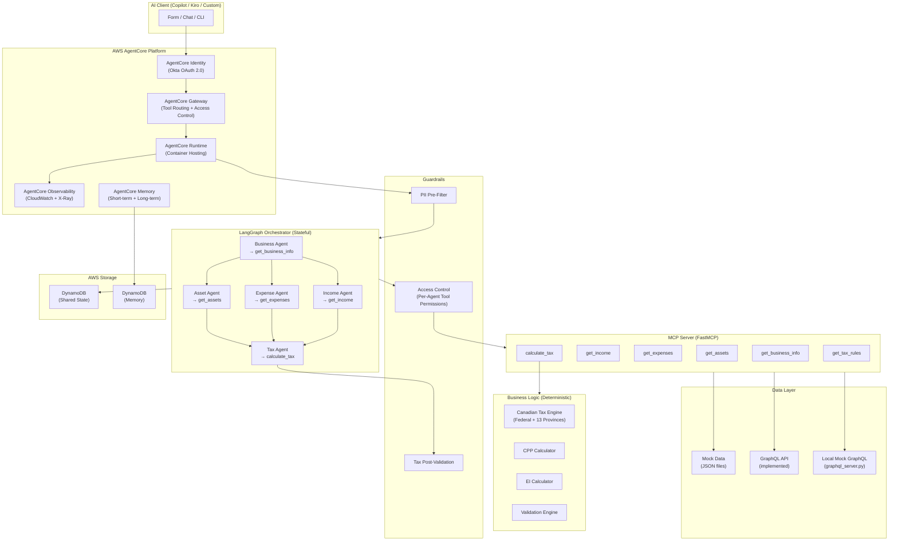

# Agentic Tax Calculator - Deployment Guide & Customization Reference

> **Reuse Note:** This guide is customer-agnostic. The architecture, deployment steps, and plug-and-play patterns work for any organization. Replace placeholder URLs (e.g., `<your-okta-domain>`, `<your-graphql-endpoint>`) with your own values.

## Architecture Diagram



## Request Flow (Step by Step)

```
1. AI Client sends tax calculation request
2. AgentCore Identity authenticates via Okta OAuth 2.0
3. AgentCore Gateway routes to AgentCore Runtime
4. PII Pre-Filter strips sensitive data before LLM
5. LangGraph Orchestrator starts 3-phase workflow:
   Phase 1: Business Agent → get_business_info (metadata + jurisdiction)
   Phase 2: Income, Expense, Asset Agents run in parallel
   Phase 3: Tax Agent aggregates → calculate_tax → validate
6. Tax Post-Validation checks calculation correctness
7. Results stored in AgentCore Memory (short-term + long-term)
8. Response returned to client
9. Observability captures metrics at every stage
```

---

## Deployment Options

### Option A: AgentCore (Recommended)

```bash
# 1. Install CLI
npm install -g @aws/agentcore

# 2. Deploy supporting infrastructure (DynamoDB + IAM)
cd infra
cdk deploy --app "python cdk_app.py"

# 3. Create AgentCore project
agentcore create --protocol MCP

# 4. Add gateway with Okta JWT auth
agentcore add gateway \
  --name TaxCalcGateway \
  --authorizer-type CUSTOM_JWT \
  --discovery-url https://<okta-domain>/oauth2/default/.well-known/openid-configuration \
  --runtimes agentic-tax-calculator

# 5. Add memory with extraction strategies
agentcore add memory \
  --name tax-calc-memory \
  --strategies SUMMARIZATION,USER_PREFERENCE

# 6. Deploy
agentcore deploy
```

### Option B: Kubernetes (Your Existing Cluster)

```bash
# 1. Build container
docker build -t agentic-tax-calculator:latest .

# 2. Push to ECR
aws ecr get-login-password | docker login --username AWS --password-stdin <account>.dkr.ecr.<region>.amazonaws.com
docker tag agentic-tax-calculator:latest <account>.dkr.ecr.<region>.amazonaws.com/agentic-tax-calculator:latest
docker push <account>.dkr.ecr.<region>.amazonaws.com/agentic-tax-calculator:latest

# 3. Deploy via Helm
helm install tax-calc ./infra/helm \
  --set image.repository=<account>.dkr.ecr.<region>.amazonaws.com/agentic-tax-calculator \
  --set image.tag=latest \
  --set config.dataSourceMode=graphql \
  --set auth.oktaDomain=<your-okta-domain>
```

### Option C: Local Development

```bash
# Start with DynamoDB Local
docker compose up -d

# Or run directly with mock data (no Docker needed)
pip install -e ".[dev]"
python -m src.api.cli --business-id BIZ001 --tax-year 2024

# Or test with the local GraphQL server (validates full integration)
python graphql_server.py &
python tests/test_graphql_integration.py
```

---

## What to Customize - Portable Components

This section maps every component you need to change to go from starter kit to production.

### 1. Data Source (HIGHEST PRIORITY)

| What | File | Change |
|------|------|--------|
| Switch from mock to real data | `.env` | `TAX_CALC_DATA_SOURCE_MODE=graphql` |
| GraphQL endpoint | `.env` | `TAX_CALC_GRAPHQL_ENDPOINT=<your-graphql-endpoint>` |
| GraphQL queries | `src/graphql/queries.py` | Update query strings to match your API's schema (field names, types, arguments) |
| GraphQL response mapping | `src/graphql/provider.py` | Adjust field mappings if your API returns data in a different structure than the mock server |
| Auth token passthrough | `src/graphql/client.py` | Bearer token is forwarded automatically. Modify if your API uses a different auth header format |

**GraphQL integration is fully implemented.** The `src/graphql/` package provides:
- `client.py` - HTTP client with bearer token passthrough, error handling, retry logic
- `provider.py` - Drop-in replacement for `MockDataProvider` (same method signatures)
- `queries.py` - GraphQL query definitions (update these for your real API schema)

**Testing with the local mock GraphQL server:**
```bash
# Start the mock server (serves same data as JSON files via real GraphQL)
python graphql_server.py
# Server at http://localhost:8090/graphql with GraphiQL playground

# Run integration tests
python tests/test_graphql_integration.py

# Or run the full MCP server against it
TAX_CALC_DATA_SOURCE_MODE=graphql \
TAX_CALC_GRAPHQL_ENDPOINT=http://localhost:8090/graphql \
python mcp_server.py
```

**Switching to your real API:**
1. Update `src/graphql/queries.py` with your actual GraphQL schema's field names and types
2. Set `TAX_CALC_GRAPHQL_ENDPOINT` to your production URL
3. Ensure auth token passthrough works (bearer token flows from client through MCP to GraphQL)

### 2. Authentication

| What | File | Change |
|------|------|--------|
| Okta domain | `.env` | `TAX_CALC_OKTA_DOMAIN=<your-okta-domain>` |
| Client credentials | `.env` | `TAX_CALC_OKTA_CLIENT_ID=xxx` and `TAX_CALC_OKTA_CLIENT_SECRET=xxx` |
| OAuth flow customization | `src/auth/identity.py` | Modify `_authenticate()` if your Okta config uses non-standard scopes or grant types |
| Auth0 integration | `src/auth/identity.py` | If you switch from Okta to Auth0, update `_token_url` construction |

### 3. Tax Rules

| What | File | Change |
|------|------|--------|
| Update tax brackets for new year | `src/tax_engine/brackets.py` | Update bracket thresholds and rates when CRA publishes new year data |
| Update CPP/EI rates | `src/tax_engine/cpp.py`, `ei.py` | Update rates, maximums, and exemptions annually |
| Add US tax support (Phase 2) | `src/tax_engine/` | Create `us_tax.py` implementing `TaxEngineInterface` with LLM-based calculation |
| Add new jurisdictions | `src/tax_engine/brackets.py` | Add bracket data to `PROVINCIAL_BRACKETS_2024` and `SUPPORTED_JURISDICTIONS` |

### 4. MCP Server Configuration

| What | File | Change |
|------|------|--------|
| Separate vs consolidated MCPs | `.env` | `TAX_CALC_MCP_DEPLOYMENT_MODE=separate` (default: consolidated) |
| Add new MCP tools | `src/mcp/tools/` | Create new tool module, register in `src/mcp/server.py` with `@mcp.tool()` |
| Tool access permissions | `src/guardrails/access_control.py` | Update `AGENT_TOOL_PERMISSIONS` dict |
| Stateful vs stateless | `src/mcp/server.py` | Change `stateless_http=False` to `True` if session state not needed |

### 5. Agent Workflow

| What | File | Change |
|------|------|--------|
| Add new agents | `src/agents/` | Create new agent class extending `BaseAgent`, add node to `src/orchestrator/graph.py` |
| Change execution order | `src/orchestrator/graph.py` | Modify `build_tax_workflow()` graph edges |
| Add parallel agents | `src/orchestrator/graph.py` | Add to the fan-out list in `_route_after_business()` |
| Shared state fields | `src/orchestrator/state.py` | Add new fields to `SharedState` TypedDict |

### 6. Guardrails & PII

| What | File | Change |
|------|------|--------|
| Add PII patterns | `src/guardrails/pii_filter.py` | Add regex patterns for your organization's sensitive data |
| Custom content filtering | `src/guardrails/pii_filter.py` | Add domain-specific filters (e.g., block non-tax questions) |
| Agent permissions | `src/guardrails/access_control.py` | Update `AGENT_TOOL_PERMISSIONS` when adding tools/agents |
| Validation rules | `src/validation/validator.py` | Add checks for your organization's business rules |

#### How Access Control Works

Each agent has a whitelist of tools it's allowed to call, defined in `src/guardrails/access_control.py`:

```python
AGENT_TOOL_PERMISSIONS = {
    "BusinessAgent": ["get_business_info"],
    "IncomeAgent": ["get_income"],
    "ExpenseAgent": ["get_expenses"],
    "AssetAgent": ["get_assets"],
    "TaxAgent": ["calculate_tax", "get_tax_rules"],
}
```

When an agent attempts a tool call, `enforce(agent_name, tool_name)` checks the matrix. Unauthorized attempts are blocked, logged with a timestamp, and recorded for audit.

This is application-level enforcement - it runs inside the agent code. For production, the recommended upgrade is **AgentCore Policy with Cedar**, which enforces access at the Gateway boundary (outside the agent code). Cedar policies look like:

```
permit(
  principal == Agent::"TaxAgent",
  action == Action::"call_tool",
  resource == Tool::"calculate_tax"
);
```

Cedar is the same policy language used by Amazon Verified Permissions. If your organization has already evaluated AVP, the same skills and policies apply to AgentCore Policy.

### 7. Memory

| What | File | Change |
|------|------|--------|
| Memory retention period | `.env` | `TAX_CALC_MEMORY_RETENTION_DAYS=90` (default) |
| Memory strategies | `agentcore/agentcore.json` | Add/remove from `memory.strategies` array |
| User preference fields | `src/memory/long_term.py` | Extend `UserPreferences` dataclass |
| Calculation summary fields | `src/memory/long_term.py` | Extend `CalcSummary` dataclass |

### 8. Observability

| What | File | Change |
|------|------|--------|
| Enable DataDog | `.env` | `TAX_CALC_DATADOG_API_KEY=your-key` |
| Disable ADOT (for DataDog) | Container env | `DISABLE_ADOT_OBSERVABILITY=true` |
| Custom metrics | `src/observability/metrics.py` | Add new counters/histograms using OTEL API |
| Streamlit dashboard | `src/observability/streamlit.py` | Extend `MetricsStore` with your custom metrics |

### 9. Infrastructure

| What | File | Change |
|------|------|--------|
| DynamoDB table names | `.env` | `TAX_CALC_DYNAMODB_TABLE_NAME` and `TAX_CALC_MEMORY_TABLE_NAME` |
| AWS region | `.env` | `TAX_CALC_AWS_REGION=us-east-1` |
| Container image | `infra/helm/values.yaml` | `image.repository` and `image.tag` |
| K8s resources | `infra/helm/values.yaml` | `resources.requests` and `resources.limits` |
| Replicas | `infra/helm/values.yaml` | `replicaCount` |

### 10. LLM Model

| What | File | Change |
|------|------|--------|
| Switch Bedrock model | `.env` | `TAX_CALC_LLM_MODEL_ID=anthropic.claude-sonnet-4-6-20250514` |
| Use different provider | `src/config/settings.py` | Add provider-specific config fields |

---

## Environment Variables - Complete Reference

```bash
# Core
TAX_CALC_DEPLOYMENT_MODE=agentcore          # agentcore | kubernetes
TAX_CALC_MCP_DEPLOYMENT_MODE=consolidated   # consolidated | separate
TAX_CALC_DATA_SOURCE_MODE=mock              # mock | graphql
TAX_CALC_GRAPHQL_ENDPOINT=                  # Required when mode=graphql

# Auth
TAX_CALC_OKTA_DOMAIN=                       # e.g. <your-okta-domain>
TAX_CALC_OKTA_CLIENT_ID=
TAX_CALC_OKTA_CLIENT_SECRET=

# AWS
TAX_CALC_AWS_REGION=us-east-1
TAX_CALC_DYNAMODB_TABLE_NAME=tax-calc-shared-state
TAX_CALC_MEMORY_TABLE_NAME=tax-calc-memory

# Memory
TAX_CALC_MEMORY_RETENTION_DAYS=90

# LLM
TAX_CALC_LLM_MODEL_ID=anthropic.claude-sonnet-4-6-20250514

# Observability
TAX_CALC_DATADOG_API_KEY=
TAX_CALC_STREAMLIT_METRICS_PORT=8501
TAX_CALC_LOG_LEVEL=INFO
```

---

## Quick Validation Checklist

After deployment, verify these work:

```bash
# 1. Mock mode - should return tax calculation for Ontario business
python -m src.api.cli --business-id BIZ001 --tax-year 2024

# 2. Mock mode - should return tax calculation for BC business
python -m src.api.cli --business-id BIZ002 --tax-year 2024

# 3. GraphQL mode - start local mock server and run integration tests
python graphql_server.py &
python tests/test_graphql_integration.py
# Should show: "All tests passed. GraphQL integration is working."

# 4. MCP server starts
python mcp_server.py
# Should show: "Running on http://0.0.0.0:8000"

# 5. Health check
curl http://localhost:8000/health
```

## Plug and Play Guide - Swapping Components for Your Environment

This section walks through exactly how to replace each mock component with your real services. Each swap is independent - do them in any order.

### Swap 1: Use Your Real GraphQL API (Instead of Mock Data)

The starter kit ships with mock JSON data and a fully implemented GraphQL integration layer. To use your real API:

```bash
# Step 1: Set environment variables
export TAX_CALC_DATA_SOURCE_MODE=graphql
export TAX_CALC_GRAPHQL_ENDPOINT=<your-graphql-endpoint>
```

Then update the GraphQL queries in `src/graphql/queries.py` to match your API's schema. The integration layer is already built:

```
src/graphql/
├── __init__.py
├── client.py       # HTTP client with bearer token passthrough + error handling
├── provider.py     # Drop-in replacement for MockDataProvider
└── queries.py      # GraphQL query strings (update these for your schema)
```

The `GraphQLDataProvider` has the same method signatures as `MockDataProvider`, so the MCP tools don't need any changes - they already route to the correct provider based on `DataSourceMode`.

**To validate the integration before connecting to production:**

```bash
# Start the included mock GraphQL server
python graphql_server.py
# Serves same data as JSON files via a real GraphQL endpoint at localhost:8090

# Run integration tests (validates full chain)
python tests/test_graphql_integration.py

# Or run the MCP server in GraphQL mode
TAX_CALC_DATA_SOURCE_MODE=graphql \
TAX_CALC_GRAPHQL_ENDPOINT=http://localhost:8090/graphql \
python mcp_server.py
```

**When connecting to your real API, update `src/graphql/queries.py`:**

```python
# Example: if your API uses different field names
GET_BUSINESS_INFO = """
query GetBusinessInfo($businessId: String!, $taxYear: Int!) {
  business(id: $businessId, taxYear: $taxYear) {
    id
    name
    accountingMethod    # <- update if your field is named differently
    jurisdiction        # <- update if your field is named differently
    ...
  }
}
"""
```

Files to review when connecting to a real API:
- `src/graphql/queries.py` - Query strings (field names, types, arguments)
- `src/graphql/provider.py` - Response field mapping (if your API nests data differently)

#### Production Security Checklist for GraphQL Switch

Switching from mock to GraphQL is not just an env var change. Your security team must authorize the connection. Complete these steps before going live:

| # | Step | Who | What |
|---|------|-----|------|
| 1 | **OAuth credentials** | Security / Identity team | Register an OAuth client with your IdP (Okta/Auth0). Provide `TAX_CALC_OKTA_DOMAIN`, `TAX_CALC_OKTA_CLIENT_ID`, `TAX_CALC_OKTA_CLIENT_SECRET`. Without these, GraphQL calls fail with 401. |
| 2 | **AgentCore Identity - Outbound Auth** | SA / DevOps | Store OAuth credentials in AgentCore Identity Token Vault (KMS-encrypted). The agent requests tokens through Identity instead of managing secrets in env vars. |
| 3 | **Network access** | DevOps / Network team | If your GraphQL API is not public, configure AgentCore Runtime with `networkMode: VPC` and set up security groups to allow the Runtime to reach your internal endpoint. |
| 4 | **API authorization** | API team | Ensure the OAuth client has the correct scopes and permissions to query business, income, expense, and asset data via GraphQL. Principle of least privilege - only the queries the agent needs. |
| 5 | **PII filter validation** | Security team | The PII pre-filter runs automatically on all data, including real GraphQL responses. Review `src/guardrails/pii_filter.py` and add any organization-specific PII patterns (e.g., internal employee IDs, custom account formats). |
| 6 | **Memory PII filtering** | Security team | Long-term memory uses the aggressive `filter_for_memory()` mode. Verify it catches your organization's sensitive data patterns before real data flows through. |
| 7 | **Access control review** | Security team | Review `AGENT_TOOL_PERMISSIONS` in `src/guardrails/access_control.py`. For production, consider migrating to AgentCore Policy with Cedar for Gateway-level enforcement. |

**The design principle:** Mock mode works with zero credentials. GraphQL mode requires your security team to explicitly authorize every layer - OAuth, network, API scopes, PII patterns. This is intentional. The agent should never access real data without your security team's sign-off.

### Swap 2: Use Your Existing Containers (Instead of Our Dockerfile)

If you already have container images for your services:

```bash
# Step 1: Point AgentCore Runtime to your container
# In agentcore/agentcore.json, update:
{
    "runtime": {
        "entryPoint": "your_existing_entrypoint.py",
        "containerImage": "<your-ecr-repo>/your-service:latest"
    }
}
```

Or for Kubernetes, update the Helm values:

```yaml
# infra/helm/values.yaml
image:
  repository: <your-ecr-repo>/agentic-tax-calculator
  tag: "your-tag"
  pullPolicy: Always
```

If your existing container already runs a Python service, you can add the MCP server as a sidecar or embed it:

```python
# Add to your existing service's startup
from src.mcp.server import mcp
# Register as an additional endpoint alongside your existing routes
```

### Swap 3: Use Your Okta Configuration (Instead of Empty Auth)

```bash
# Step 1: Set Okta credentials
export TAX_CALC_OKTA_DOMAIN=<your-okta-domain>
export TAX_CALC_OKTA_CLIENT_ID=your-client-id
export TAX_CALC_OKTA_CLIENT_SECRET=your-client-secret
```

If you use Auth0 instead of Okta, modify `src/auth/identity.py`:

```python
# Change the token URL construction
self._token_url = f"https://{self._okta_domain}/oauth/token"  # Auth0 format
```

If you need the "on behalf of user" pattern (no explicit user authorization):

```python
# Already implemented - just call:
token = auth_client.get_token()  # Uses client_credentials grant
# No user interaction required
```

### Swap 4: Use Your DynamoDB Tables (Instead of Starter Kit Tables)

```bash
# Point to your existing tables
export TAX_CALC_DYNAMODB_TABLE_NAME=your-existing-state-table
export TAX_CALC_MEMORY_TABLE_NAME=your-existing-memory-table
```

Table schema requirements:
- Partition key: `PK` (String)
- Sort key: `SK` (String)
- TTL attribute: `ttl` (optional, for auto-expiry)

If your tables use different key names, update `src/orchestrator/checkpointer.py`.

### Swap 5: Use Your Observability Stack (Instead of CloudWatch Only)

For DataDog:
```bash
export TAX_CALC_DATADOG_API_KEY=your-dd-api-key
# In container, also set:
export DISABLE_ADOT_OBSERVABILITY=true
```

For Streamlit dashboards:
```python
# The MetricsStore singleton is already collecting data
# Build your Streamlit app reading from:
from src.observability.streamlit import MetricsStore
store = MetricsStore.instance()
tool_metrics = store.get_tool_metrics()
workflow_metrics = store.get_workflow_metrics()
```

### Swap 6: Add Your Custom Business Logic

To add new MCP tools for future use cases (e.g., bank PDF import):

```python
# 1. Create src/mcp/tools/bank_import.py
def import_bank_pdf(pdf_url: str, business_id: str) -> dict:
    # Your Textract + Claude 3.5 logic here
    ...

# 2. Register in src/mcp/server.py
@mcp.tool()
def import_bank_pdf(pdf_url: str, business_id: str) -> dict:
    """Import bank statement PDF and convert to CSV."""
    return _import_bank_pdf(pdf_url, business_id)

# 3. Update access control in src/guardrails/access_control.py
AGENT_TOOL_PERMISSIONS["BankImportAgent"] = ["import_bank_pdf"]
```

### Swap 7: Use Your Dev Environment

For development in your Kubernetes dev environment:

```yaml
# dev-environment.yml (add to your existing dev config)
services:
  agentic-tax-calculator:
    build: ./agentic-tax-calculator
    command: opentelemetry-instrument python mcp_server.py
    ports:
      - 8000:8000
    environment:
      - TAX_CALC_DATA_SOURCE_MODE=mock
      - TAX_CALC_LOG_LEVEL=DEBUG
      - DISABLE_ADOT_OBSERVABILITY=true
```

### Swap Summary - What Changes vs What Stays

| Component | Default (Starter Kit) | Production | What to Change |
|-----------|----------------------|-----------------|----------------|
| Data source | Mock JSON files | Your GraphQL API | Env vars + update queries in `src/graphql/queries.py` |
| Auth | No auth (empty tokens) | Okta OAuth 2.0 | Env vars only |
| Containers | Our Dockerfile | Your existing images | Helm values or agentcore.json |
| DynamoDB | Local tables | Your existing tables | Env vars only |
| Observability | CloudWatch | DataDog + Streamlit | Env var for DD key |
| Tax rules | 2024 CRA brackets | Same (update annually) | `brackets.py` when CRA publishes new rates |
| LLM model | Claude Sonnet 4 | Same or different | Env var |
| MCP deployment | Consolidated | Separate (your preference) | Env var |
| Memory | AgentCore Memory | Same | Env vars for retention |
| Guardrails | PII filter + access control | Same + custom rules | Add patterns to `pii_filter.py` |


## Extending the Platform - Adding Clients, Tools, and Agents

This starter kit is designed as a platform foundation, not a one-off project. The tax calculator is use case #1. Adding new capabilities is additive - no rearchitecting required.

### Add AI Clients (Zero Code Changes)

Any MCP-compatible client connects to the Gateway endpoint URL. No server-side changes needed.

| Client | How to Connect |
|--------|---------------|
| Copilot | Point at the Gateway MCP endpoint URL with auth credentials |
| Kiro | Add the Gateway URL as an MCP server in `.kiro/settings/mcp.json` |
| Claude Desktop | Add the Gateway URL in Claude's MCP config |
| Custom frontend | Use the MCP SDK client (`mcp.client.streamable_http`) to connect |

The Gateway handles auth, tool discovery, and routing for all clients identically.

### Add New MCP Tools (3 Steps)

Each new use case = a new tool module. No changes to existing tools or infrastructure.

```bash
# Step 1: Create the tool
# src/mcp/tools/bank_import.py
def import_bank_pdf(pdf_url: str, business_id: str) -> dict:
    """Import bank statement PDF and extract transactions."""
    # Your Textract + Claude logic here
    ...

# Step 2: Register in src/mcp/server.py
@mcp.tool()
def import_bank_pdf(pdf_url: str, business_id: str) -> dict:
    """Import bank statement PDF and extract transactions."""
    return _import_bank_pdf(pdf_url, business_id)

# Step 3: Update access control in src/guardrails/access_control.py
AGENT_TOOL_PERMISSIONS["BankImportAgent"] = ["import_bank_pdf"]
```

Deploy with `agentcore deploy`. The new tool appears in the Gateway automatically.

### Add New Agents (2 Steps)

```python
# Step 1: Create src/agents/bank_import.py
def bank_import_node(state: SharedState) -> SharedState:
    # Agent logic - calls import_bank_pdf tool
    ...

# Step 2: Add to src/orchestrator/graph.py
graph.add_node("bank_import", bank_import_node)
graph.add_edge("bank_import", "tax")  # or wherever it fits in the workflow
```

The new agent inherits all existing infrastructure: guardrails, PII filtering, access control, observability, and memory.

### Add External MCP Servers (Gateway Targets)

The Gateway supports multiple targets. Add third-party or internal MCP servers alongside the tax calculator Runtime.

```bash
# Add a Salesforce MCP server as a Gateway target
agentcore add gateway-target \
  --name SalesforceTools \
  --gateway TaxCalcGateway \
  --type mcp-server \
  --endpoint "https://your-salesforce-mcp-server.example.com/mcp"
```

The Gateway discovers tools from all targets and routes calls to the correct server. Agents can use tools from any target through the same interface.

### Extensibility Summary

| What to Add | Steps | Infrastructure Changes |
|-------------|-------|----------------------|
| New AI client | Point client at Gateway URL | None |
| New MCP tool | 1 Python file + register + access control | `agentcore deploy` |
| New agent | 1 Python file + add to graph | `agentcore deploy` |
| External MCP server | Add Gateway target | `agentcore deploy` |
| New tax jurisdiction | Add brackets to `brackets.py` | `agentcore deploy` |
| LLM-based engine (US tax) | Implement `TaxEngineInterface` | `agentcore deploy` |

All additions are additive. Existing tools, agents, and clients are unaffected.

## Support

For questions about this starter kit, contact your AWS account team.
