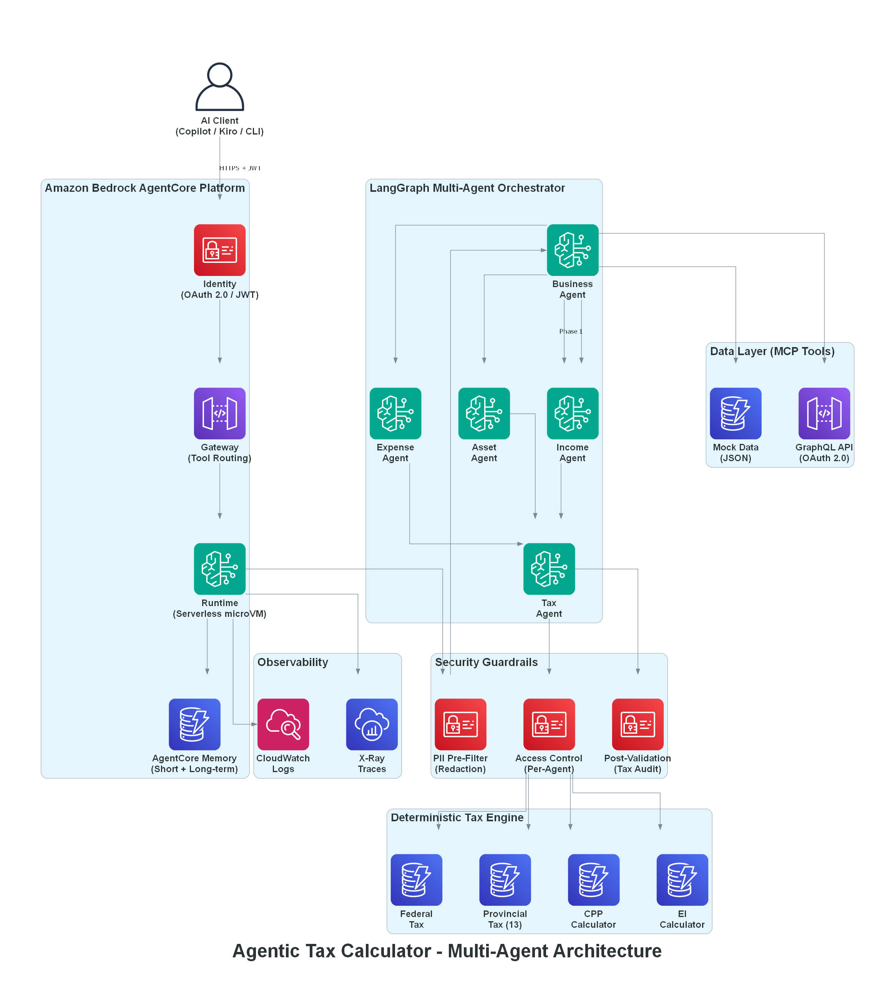
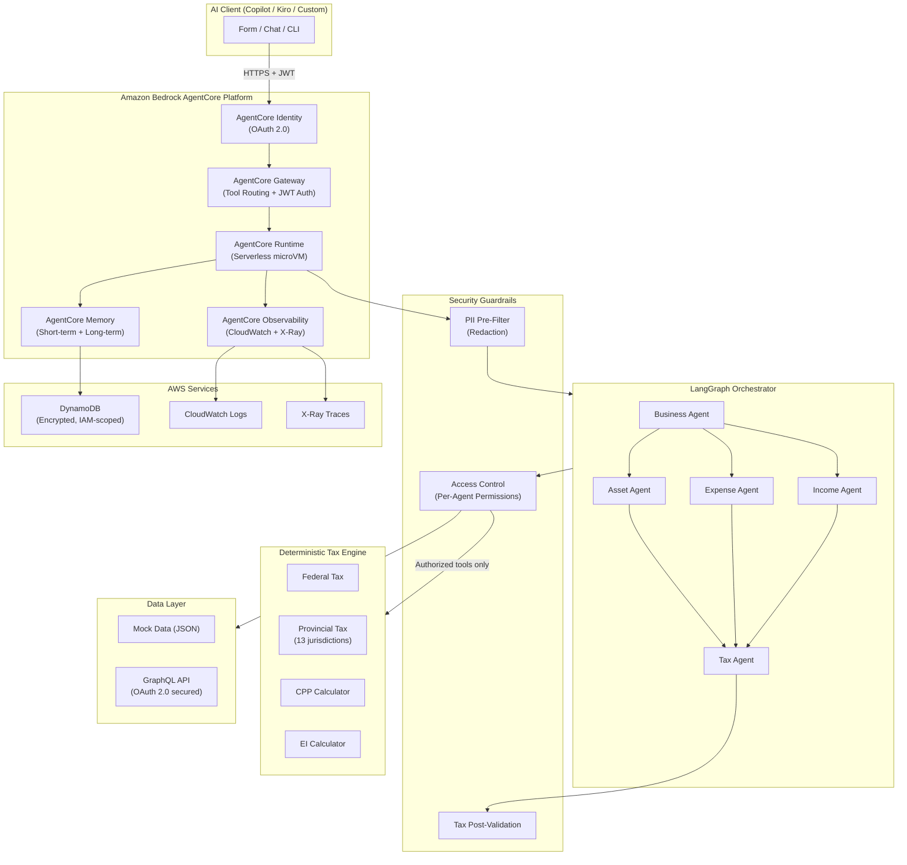

# Agentic Tax Calculator

Multi-agent AI starter kit for deterministic tax computation using Amazon Bedrock AgentCore, LangGraph, and MCP.

> **Reuse Note:** This starter kit is customer-agnostic. All source code in `src/`, configuration, agents, tax engine, guardrails, and MCP server contain no customer-specific references.
> - Mock data in `src/mock/data/*.json` uses fictional business names and can be used as-is or replaced with your own test data.

> **Important:** This is sample code for demonstration and educational purposes. It is not intended for production use without additional security testing, compliance validation, and legal review. You are responsible for testing, securing, and optimizing this code as appropriate for production grade use based on your specific quality control practices and standards. The mock data included is entirely fictional and not derived from any real customer data.

Agentic Canadian tax calculator - an Amazon Bedrock AgentCore starter kit.

## Overview

A configurable reference implementation that uses multi-agent LangGraph orchestration
backed by Amazon Bedrock AgentCore services to gather business data via MCP tool groups, then
deterministically compute federal, provincial, CPP, and EI tax liabilities for
Canadian small businesses across all 13 provinces and territories.

The system works **out of the box with mock data** - no external credentials needed.
Swap to real services by changing environment variables only.





## Prerequisites

- **Python 3.11+**
- **Node.js 18+** (for AgentCore CLI)
- **AWS CLI v2** (for CDK deployment)
- **Docker** (optional, for local DynamoDB and container builds)

## Installation

```bash
# Clone and install
cd agentic-tax-calculator
pip install -e ".[dev]"
```

## Running with Mock Data

No credentials required. The system uses built-in mock data by default.

```bash
# Option 1: Interactive demo UI (recommended for first look)
pip install -e ".[demo]"
streamlit run demo_ui.py

# Option 2: Run the MCP server directly
python mcp_server.py

# Option 3: Run via the unified entry point
python -m src.app

# Option 4: Run a quick tax calculation via CLI
python -m src.api.cli
```

> **Demo UI:** The Streamlit demo shows the full system - form + chat UX, live guardrails, observability hooks, and architecture config. See [DEMO_QUICKSTART.md](DEMO_QUICKSTART.md) for local, Docker, and AWS deployment options.

### Run Tests

```bash
pytest
```
## Configuration

All settings are controlled via `TAX_CALC_` prefixed environment variables.
Create a `.env` file or export them directly.

| Variable | Default | Description |
|----------|---------|-------------|
| `TAX_CALC_DEPLOYMENT_MODE` | `agentcore` | `agentcore` or `kubernetes` |
| `TAX_CALC_DATA_SOURCE_MODE` | `mock` | `mock` or `graphql` |
| `TAX_CALC_GRAPHQL_ENDPOINT` | _(empty)_ | GraphQL API URL (required when mode=graphql) |
| `TAX_CALC_OKTA_DOMAIN` | _(empty)_ | Okta domain for OAuth 2.0 |
| `TAX_CALC_OKTA_CLIENT_ID` | _(empty)_ | Okta client ID |
| `TAX_CALC_OKTA_CLIENT_SECRET` | _(empty)_ | Okta client secret |
| `TAX_CALC_DYNAMODB_TABLE_NAME` | `tax-calc-shared-state` | DynamoDB table for workflow state |
| `TAX_CALC_MEMORY_TABLE_NAME` | `tax-calc-memory` | DynamoDB table for long-term memory |
| `TAX_CALC_MEMORY_RETENTION_DAYS` | `90` | Long-term memory retention |
| `TAX_CALC_AWS_REGION` | `us-east-1` | AWS region |
| `TAX_CALC_LOG_LEVEL` | `INFO` | Logging level |
| `TAX_CALC_LLM_MODEL_ID` | `anthropic.claude-sonnet-4-6-20250514` | Bedrock model ID |
| `TAX_CALC_DATADOG_API_KEY` | _(empty)_ | DataDog API key for metrics forwarding |

See `src/config/settings.py` for the full list.

### Switching to Real Services

```bash
# Point to your GraphQL API
export TAX_CALC_DATA_SOURCE_MODE=graphql
export TAX_CALC_GRAPHQL_ENDPOINT=<your-graphql-endpoint>

# Configure Okta auth
export TAX_CALC_OKTA_DOMAIN=<your-okta-domain>
export TAX_CALC_OKTA_CLIENT_ID=your-client-id
export TAX_CALC_OKTA_CLIENT_SECRET=your-client-secret
```

### Running with the Local GraphQL Server (Integration Testing)

A local mock GraphQL server is included for testing the full integration plumbing
without needing access to a production API. It serves the same data as the JSON
mock files but through a real GraphQL endpoint.

```bash
# Terminal 1: Start the local GraphQL server
pip install -e ".[dev]"
python graphql_server.py
# Server at http://localhost:8090/graphql
# GraphiQL playground available in browser at same URL

# Terminal 2: Run integration tests
python tests/test_graphql_integration.py

# Terminal 2 (alternative): Run the MCP server in GraphQL mode
TAX_CALC_DATA_SOURCE_MODE=graphql TAX_CALC_GRAPHQL_ENDPOINT=http://localhost:8090/graphql python mcp_server.py
```

This validates the full chain: MCP tools -> GraphQLDataProvider -> GraphQLClient -> HTTP -> GraphQL server -> response mapping. When ready for production, swap the endpoint URL to your real API and update `src/graphql/queries.py` to match your schema.

## AgentCore Deployment

### 1. Install AgentCore CLI

```bash
npm install -g @aws/agentcore
```

### 2. Create the AgentCore project

```bash
agentcore create --protocol MCP
```

### 3. Deploy supporting infrastructure (DynamoDB + IAM)

```bash
cd infra
cdk deploy --app "python cdk_app.py"
```

### 4. Add gateway with Okta JWT auth

```bash
agentcore add gateway \
  --name TaxCalcGateway \
  --authorizer-type CUSTOM_JWT \
  --discovery-url https://<okta-domain>/oauth2/default/.well-known/openid-configuration \
  --runtimes agentic-tax-calculator
```

### 5. Add memory with strategies

```bash
agentcore add memory \
  --name tax-calc-memory \
  --strategies SUMMARIZATION,USER_PREFERENCE
```

### 6. Deploy to AgentCore

```bash
agentcore deploy
```

## Kubernetes Deployment

### Local Development with Docker Compose

```bash
# Start MCP server + DynamoDB Local
docker compose up -d

# Server available at http://localhost:8000
# DynamoDB Local at http://localhost:8001
```

### Helm Chart Deployment

```bash
# Deploy to existing K8s cluster
helm install tax-calc ./infra/helm \
  --set image.repository=your-ecr-repo/agentic-tax-calculator \
  --set image.tag=latest \
  --set config.dataSourceMode=graphql \
  --set auth.oktaDomain=<your-okta-domain>

# Upgrade
helm upgrade tax-calc ./infra/helm --set image.tag=v1.1.0
```

### Build Container Image

```bash
docker build -t agentic-tax-calculator:latest .
```

## Architecture



### Request Flow

```
AI Client → AgentCore Identity (OAuth 2.0 / Okta)
          → AgentCore Gateway
          → AgentCore Runtime
          → PII Pre-filter (Guardrails)
          → LangGraph Orchestrator
              Phase 1: Business Agent → get_business_info
              Phase 2: Income Agent   → get_income     (parallel)
                       Expense Agent  → get_expenses   (parallel)
                       Asset Agent    → get_assets     (parallel)
              Phase 3: Tax Agent      → calculate_tax + validate
          → Tax Post-validation (Guardrails)
          → Response
```

### Agent Workflow

1. **Business Agent** - retrieves business metadata (accounting method, jurisdiction)
2. **Income Agent** - queries CREDIT accounts, calculates total revenue
3. **Expense Agent** - queries DEBIT accounts, calculates total expenses
4. **Asset Agent** - queries HST/GST tax account data
5. **Tax Agent** - aggregates all data, invokes deterministic tax engine, validates result

### MCP Tools

| Tool | Description |
|------|-------------|
| `get_business_info` | Business metadata (accounting method, jurisdiction) |
| `get_income` | P&L CREDIT accounts and total revenue |
| `get_expenses` | P&L DEBIT accounts and total expenses |
| `get_assets` | HST/GST tax account data |
| `calculate_tax` | Deterministic Canadian tax computation |
| `get_tax_rules` | CRA bracket rules for any jurisdiction |

## Project Structure

```
agentic-tax-calculator/
├── agentcore/
│   └── agentcore.json          # AgentCore deployment config
├── infra/
│   ├── cdk_app.py              # CDK stack (DynamoDB + IAM)
│   └── helm/                   # Kubernetes Helm chart
│       ├── Chart.yaml
│       ├── values.yaml
│       └── templates/
├── src/
│   ├── app.py                  # Unified entry point (mode switching)
│   ├── config/                 # Pydantic settings + env vars
│   ├── agents/                 # 5 LangGraph agents
│   ├── orchestrator/           # LangGraph workflow + DynamoDB checkpointer
│   ├── mcp/                    # FastMCP server + 6 tool modules
│   ├── graphql/                # GraphQL client + provider + query definitions
│   ├── tax_engine/             # Deterministic Canadian tax engine
│   ├── validation/             # Post-validation engine
│   ├── guardrails/             # PII filter + access control
│   ├── memory/                 # Short-term + long-term memory
│   ├── auth/                   # Okta OAuth 2.0 client
│   ├── observability/          # OpenTelemetry metrics + DataDog/Streamlit hooks
│   ├── mock/                   # Mock data layer (JSON files)
│   └── api/                    # Request handler + schemas
├── tests/
│   └── test_graphql_integration.py  # GraphQL integration tests
├── mcp_server.py               # AgentCore entry point
├── graphql_server.py           # Local mock GraphQL server (for testing)
├── demo_ui.py                  # Streamlit demo UI (5 tabs)
├── Dockerfile
├── Dockerfile.demo             # Demo UI container
├── docker-compose.yml
├── pyproject.toml
├── requirements.txt            # Runtime deps for AgentCore
├── DEMO_QUICKSTART.md          # Demo deployment guide
└── DEPLOYMENT_GUIDE.md         # Full production deployment reference
```

## Supported Jurisdictions

All 13 Canadian provinces and territories:
AB, BC, MB, NB, NL, NS, NT, NU, ON, PE, QC, SK, YT

## Phase 2 (Planned)

- Bank Transaction PDF Import (Amazon Textract + Claude 3.5)
- US Tax Support (IRS federal + state brackets)

## Security

This application processes sensitive financial data. Security responsibilities follow the [AWS Shared Responsibility Model](https://aws.amazon.com/compliance/shared-responsibility-model/).

**AWS is responsible for security OF the cloud:**
- Amazon Bedrock AgentCore Runtime infrastructure security
- Amazon Bedrock model security and compliance
- DynamoDB encryption at rest
- Network infrastructure protection

**You are responsible for security IN the cloud:**
- Application code security
- Authentication configuration (Okta/Cognito)
- PII filter rules and testing
- Access control policies
- Security testing and validation

### Data Flow Security

PII is filtered at each stage of the request lifecycle:

```
Client Input → PII Pre-Filter (redacts SIN, bank accounts, addresses)
    → LLM Orchestration (receives only sanitized data)
    → MCP Tools (access controlled per agent)
    → Tax Engine (deterministic, no PII stored)
    → Response Post-Validation (checks for data leakage)
    → Memory Storage (aggressive filter_for_memory() applied)
```

All data in transit uses TLS 1.2+. GraphQL endpoints enforce HTTPS in production mode.

### Data Classification and Handling

| Classification | Examples | Handling |
|---------------|----------|----------|
| **Restricted** | SIN numbers, bank account numbers, personal addresses | Redacted by PII filter before LLM processing and memory storage. Never persisted in plain text. |
| **Confidential** | Tax calculations, revenue figures, expense details | Encrypted at rest (DynamoDB), access controlled via IAM, 90-day default retention in memory |
| **Internal** | Business names, jurisdictions, accounting methods | Encrypted at rest, access controlled via IAM |
| **Public** | Tax bracket rules, CRA rates, provincial rates | No special handling required |

Data retention: Memory defaults to 90 days (configurable via `TAX_CALC_MEMORY_RETENTION_DAYS`). DynamoDB tables use TTL for automatic expiry. For tax compliance, organizations may need 7-year retention for calculation records.

### Key Management

This project uses **AWS-managed encryption keys** for DynamoDB tables. Rationale:

- Operational simplicity for sample code and development environments
- AWS automatically rotates AWS-managed keys annually
- No additional KMS costs or key policy management required
- Encryption at rest is always enabled (cannot be disabled)

For production deployments requiring customer-managed keys:
1. Create a KMS key with appropriate key policy
2. Update `cdk_app.py`: change `encryption=dynamodb.TableEncryption.AWS_MANAGED` to `dynamodb.TableEncryption.CUSTOMER_MANAGED` with your key
3. Grant the AgentCore Runtime role `kms:Encrypt`, `kms:Decrypt`, `kms:GenerateDataKey` on the key
4. Enable automatic key rotation
5. Restrict key access to the Runtime role and authorized administrators

AgentCore Memory uses AWS-owned keys (managed entirely by the service, no customer visibility or management needed).

### Quick Security Setup

```bash
# Configure authentication
export TAX_CALC_OKTA_DOMAIN=your-domain.okta.com
export TAX_CALC_OKTA_CLIENT_ID=<client-id>
export TAX_CALC_OKTA_CLIENT_SECRET=<secret>

# Run PII filter tests
python -m pytest tests/ -k pii -v

# Run dependency vulnerability scan
pip-audit

# Review access control matrix
# See src/guardrails/access_control.py for agent-to-tool permissions
```

> **Disclaimer:** Tax calculations produced by this system are for informational and demonstration purposes only. Results should be verified by a licensed tax professional before use in any financial decision-making. The LLM is used only for orchestration - all tax computations use the deterministic rules engine in `src/tax_engine/`.

### Bias and Fairness

The LLM orchestration layer is designed for equitable treatment across all supported jurisdictions and business types:

- **Jurisdiction fairness:** All 13 Canadian provinces and territories use identical orchestration flows. No jurisdiction receives different treatment in tool selection or data gathering.
- **Business type equity:** The agent workflow is deterministic in structure (Business -> Income/Expense/Asset in parallel -> Tax). Business size, type, or name does not influence orchestration routing.
- **Testing methodology:** Integration tests verify consistent orchestration behavior across all supported jurisdictions. Mock data includes businesses of varying sizes to confirm no systematic bias.
- **Monitoring:** Post-validation guardrails verify calculation correctness independent of orchestration path. Anomalous routing patterns are logged via AgentCore Observability.

See [SECURITY.md](SECURITY.md) "Bias and Fairness Considerations" for detailed analysis.

This is sample code for non-production usage. You should work with your security and legal teams to meet your organizational security, regulatory, and compliance requirements before deployment.

See [SECURITY.md](SECURITY.md) for the full threat model and production checklist.
See [CONTRIBUTING](CONTRIBUTING.md#security-issue-notifications) for reporting security issues.

### Security Testing Results

This sample code has undergone security scanning as part of the PCSR (Public Content Security Review) process:

- **Static analysis:** AWS Slingshot (May 2026) - All HIGH/CRITICAL code-level findings remediated. 2 false positives documented (Bandit B105 - empty string OAuth placeholders).
- **Dependency scan:** pip-audit - 0 known vulnerabilities at time of publication.
- **Detailed results:** See [SECURITY_SCAN_RESULTS.md](SECURITY_SCAN_RESULTS.md) for complete findings, remediations, and compensating controls.

**Important:** This is sample code. You must perform your own security testing and validation before production deployment. Run `pip-audit` and your organization's SAST tools against the codebase before deploying with real data.

## License

This library is licensed under the MIT-0 License. See the [LICENSE](LICENSE) file.
